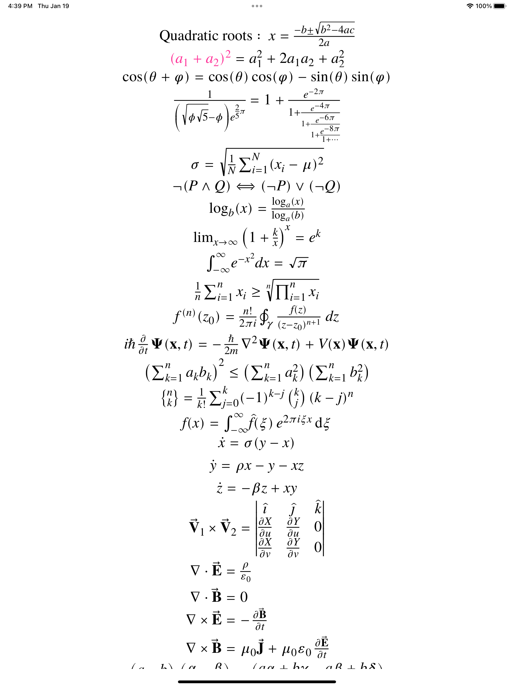
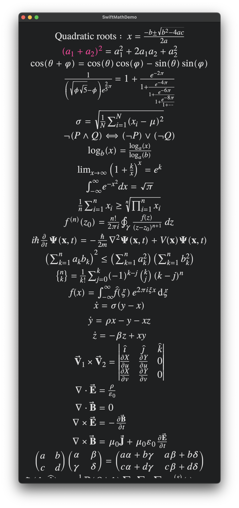

# SwiftMathDemo

`SwiftMathDemo` demonstrates the use of [SwiftMath](https://github.com/mgriebling/SwiftMath.git) within a traditional
storyboard controlled by a viewcontroller.  Code is entirely written in Swift (except for the `SwiftMath` package).
This demo is free of alien pods and the ensuing magical incantations that everyone hates.
This same demo, although in Objective-C, is available from [iosMath](https://travis-ci.org/kostub/iosMath) (with alien pods).

To use `SwiftMath` in your own code, just add the following package path to XCode: https://github.com/mgriebling/SwiftMath.git

## Examples
Here are screenshots of an iPad, iPhone, and Mac(catalyst) running the demo:

